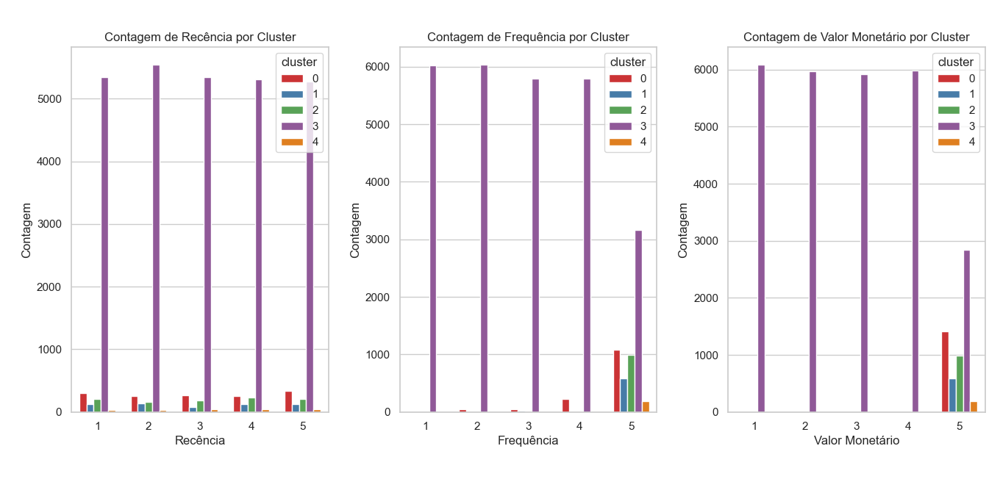

# Análise dos Dados, Análise RFV e Clusterização

# 1. CRISP-DM
Para este projeto irei utilizar a abordagem  CRISP-DM (Cross-Industry Standard Process for Data Mining).

O CRISP-DM é uma metodologia amplamente utilizada para guiar projetos de ciência de dados. Ele oferece uma estrutura organizada em seis fases principais que ajudam a conduzir o processo de análise de dados desde o planejamento até a implementação

## 1.1 Entendimento do Negócio
**Objetivo:** Analisar detalhadamente os dados de vendas para fornecer respostas a 5 perguntas chave de negócios, realizar uma análise RFM (Recência, Frequência e Valor Monetário) para segmentar os clientes de acordo com seus comportamentos de compra e aplicar técnicas de clusterização para identificar grupos distintos de clientes. Após essa segmentação, será implementada uma análise preditiva utilizando Random Forest para prever a probabilidade de um cliente pertencer a determinado cluster e entender quais fatores mais influenciam essa classificação. 

**Impacto esperado:** A análise permitirá uma segmentação mais eficaz dos clientes, revelando padrões de comportamento que podem ser utilizados para personalizar campanhas de marketing e estratégias de retenção. Além disso, a identificação das variáveis mais importantes no processo de decisão facilitará o desenvolvimento de ações direcionadas, melhorando a experiência do cliente e potencializando as vendas.

## 1.2 Entendimento dos Dados
**Dataset:** Online Retail II, disponível [aqui.](https://archive.ics.uci.edu/dataset/502/online+retail+ii) O conjunto de dados contém transações de uma loja de varejo online com sede no Reino Unido, abrangendo o período entre 2009 e 2011.
- **Dicionário de Variáveis**
    - InvoiceNo: Número da Fatura. Nominal. Um número inteiro de 6 dígitos atribuído de forma única a cada transação. Se este código começar com a letra 'c', indica um cancelamento.
    - StockCode: Código do Produto. Nominal. Um número inteiro de 5 dígitos atribuído de forma única a cada produto distinto.
    - Description: Descrição do Produto. Nominal. Nome do produto (item).
    - Quantity: Quantidade. Numérico. Quantidade de cada produto por transação.
    - InvoiceDate: Data e Hora da Fatura. Numérico. O dia e a hora em que a transação foi gerada.
    - UnitPrice: Preço Unitário. Numérico. Preço do produto por unidade em libras esterlinas (£).
    - CustomerID: Número do Cliente. Nominal. Um número inteiro de 5 dígitos atribuído de forma única a cada cliente.
    - Country: País. Nominal. Nome do país onde o cliente reside.   
- **Identificamos nos dados algumas entradas de código de produto com as letras ('M', 'D', 'BANK CHARGES', etc.), que estão relacionadas a outros tipos de transações, como ajustes manuais, taxas e serviços adicionais. Esses códigos não são propriamente produtos físicos, mas serviços ou correções. Esses aspectos deverão ser levados em conta durante o projeto.**

**Fonte:** Conjunto de dados de transações online de uma loja de varejo, incluindo informações como ID do cliente, produtos comprados, quantidade, data e preço.

**Estrutura de dados:** Contém tanto variáveis numéricas (como quantidade e preço) quanto variáveis categóricas (descrição do produto, país). Essas variáveis serão analisadas e manipuladas conforme necessário para atender aos objetivos do projeto, como a clusterização e a análise preditiva.

## 1.3 Preparação dos Dados
**Armazenamento:** Inserção dos dados em um banco de dados MySQL para facilitar a manipulação e execução de consultas. O acesso será feito através da integração com SQLAlchemy no Python, permitindo consultas eficientes e a realização de operações sobre os dados.

**Análise de Dados:** Utilização de queries SQL para responder a 5 perguntas estratégicas de negócios, explorando o comportamento dos clientes e identificando tendências de vendas e padrões de compra.

**Análise RFV:** Aplicação de SQL para calcular Recência, Frequência e Valor Monetário (RFV) dos clientes. Essa análise permitirá a segmentação dos clientes com base em sua relevância para o negócio, fornecendo uma visão clara de quais clientes têm maior valor.

**Preparação para Clusterização:** Normalização dos dados e remoção de variáveis irrelevantes para garantir que a clusterização seja feita de maneira eficiente e com dados otimizados. O processo de preparação inclui a transformação das variáveis para que o algoritmo de clusterização KMeans funcione adequadamente.

**Árvore de Decisão (Random Forest):** Após a segmentação dos clientes por meio do KMeans, uma árvore de decisão, utilizando o modelo Random Forest, será aplicada para prever a probabilidade de um cliente pertencer a determinado cluster. Essa etapa é essencial, pois a árvore de decisão não apenas gera previsões, mas também nos mostra as variáveis que mais impactaram a segmentação. Com isso, será possível identificar quais fatores são determinantes na classificação dos clientes, permitindo uma melhor compreensão do comportamento deles e auxiliando na criação de estratégias de marketing mais eficazes.

## 1.4 Modelagem
**Clusterização:** Aplicação do KMeans para segmentação de clientes. Uso dos métodos do cotovelo e da silhueta para determinar o número ideal de clusters.

**Classificação:** Inclusão dos rótulos de cluster no dataset e aplicação de Random Forest para prever a probabilidade de um cliente pertencer a um determinado cluster.

**Interpretação:** Análise das features mais importantes no modelo Random Forest para entender os fatores-chave na classificação dos clientes.

## 1.5 Avaliação

**Métricas de Clusterização:** A qualidade dos clusters será avaliada utilizando duas abordagens principais:  
- Método do Cotovelo: Avalia a inércia (soma das distâncias quadradas dentro dos clusters) para determinar o número ideal de clusters. A escolha do ponto de inflexão no gráfico de inércia indicará o número adequado de clusters.
- Coeficiente de Silhueta: Medirá a coesão e a separação dos clusters. Um valor de silhueta próximo de 1 indica que os clientes estão bem segmentados em seus respectivos grupos, enquanto valores próximos de 0 indicam que eles estão mal segmentados ou nas fronteiras dos clusters.

**Métricas de Classificação:** A classificação será feita utilizando Random Forest, e a principal métrica de avaliação será o **Log Loss (Perda Logarítmica)**, que é a métrica mais adequada quando o objetivo é otimizar a probabilidade de um cliente pertencer a determinado cluster. O Log Loss penaliza previsões de probabilidade incorretas de forma mais sensível, garantindo que o modelo não apenas acerte a classe, mas também faça previsões de probabilidade robustas e confiáveis.

## 1.6 Implementação

**Entrega dos resultados:**  Além da documentação e apresentação dos resultados, incluindo as respostas detalhadas às cinco perguntas de negócios propostas, será disponibilizada uma tabela detalhada contendo a formação dos clusters e a probabilidade de cada cliente pertencer a cada um deles. Essa tabela poderá ser utilizada como uma base para alimentar diversos processos de negócios, como a personalização de campanhas de marketing, a otimização de estratégias de retenção e o desenvolvimento de ofertas personalizadas para cada segmento de clientes.

# 2. Projeto
## 2.1 Ferramentas e Tecnologias Utilizadas:
- Linguagens: 
    - Python 3.11.4
    - SQL
- Banco de Dados: MySQL.
- Bibliotecas e suas versões:  [`requirements.txt`](./requirements.txt).
- Versionamento: Git.
- Análise de Cluster: KMeans, métodos do cotovelo e silhueta.
- Análise preditiva: Random Forest.

## 2.2 Perguntas de negócios
- 1: Quais produtos são os mais vendidos?
Como podemos identificar os itens mais populares entre os clientes para garantir que o estoque desses produtos esteja sempre disponível?
- 2: Quais os produtos mais compradas em diferentes períodos do ano? Como a sazonalidade afeta a demanda por determinados produtos e como podemos otimizar nosso inventário com base nessas informações?
- 3: Quais são os períodos de pico de vendas? Quais dias têm maior volume de vendas? Podemos ajustar nossa estratégia de marketing ou oferta de produtos durante esses períodos?
- 4: Quais clientes são responsáveis pelas maiores receitas? Quem são os clientes que mais gastam com base no valor total de suas compras?
- 5: Existem produtos com baixa rotatividade e valor unitário reduzido que deveriam ser descontinuados? Produtos com baixo volume de vendas e preço inferior podem comprometer a eficiência do inventário e, por isso, devem ser reavaliados. Para este cenário, consideraremos produtos que venderam menos de 30 unidades nos últimos dois anos e cujo valor unitário seja inferior a 1000 dólares.

# 3 Resultados
## 3.1 Perguntas de negócios
**1 -  Quais produtos são os mais vendidos? Como podemos identificar os itens mais populares entre os clientes para garantir que o estoque desses produtos esteja sempre disponível?**
- Os produtos mais vendidos, conforme a análise de vendas atualizada, incluem itens como WORLD WAR 2 GLIDERS ASSTD DESIGNS, com 109.169 unidades vendidas, seguido por WHITE HANGING HEART T-LIGHT HOLDER, com 93.640 unidades, e PAPER CRAFT, LITTLE BIRDIE, com 80.995 unidades. Outros produtos populares incluem ASSORTED COLOUR BIRD ORNAMENT e MEDIUM CERAMIC TOP STORAGE JAR, com 79.913 e 77.916 unidades vendidas, respectivamente. Além disso, há destaque para várias variações de caixas de bolo, como a PACK OF 60 PINK PAISLEY CAKE CASES (55.270 unidades), 60 TEATIME FAIRY CAKE CASES (53.495 unidades) e PACK OF 72 RETROSPOT CAKE CASES (46.107 unidades), além do JUMBO BAG RED RETROSPOT, que atingiu 75.759 unidades. Para garantir que o estoque desses itens esteja sempre disponível e atender à demanda dos clientes, é fundamental identificar regularmente esses produtos mais vendidos. Ao fazer isso, a empresa pode evitar rupturas de estoque, melhorar a experiência do cliente, aumentar as vendas e minimizar os custos associados a excessos ou faltas de produtos em estoque.

 **2 -  Quais os produtos mais compradas em diferentes períodos do ano? Como a sazonalidade afeta a demanda por determinados produtos e como podemos otimizar nosso inventário com base nessas informações?** 
 - A análise dos produtos mais vendidos ao longo dos meses revela padrões sazonais importantes. Em janeiro, o MEDIUM CERAMIC TOP STORAGE JAR foi o destaque com 74.215 unidades vendidas. Em fevereiro, o item de maior demanda foi o BLACK AND WHITE PAISLEY FLOWER MUG, com 19.248 unidades. Já em março, o SET/6 WOODLAND PAPER PLATES foi o mais vendido, com 13.099 unidades. O WORLD WAR 2 GLIDERS ASSTD DESIGNS apresentou bons números em abril, maio, junho e outubro, com vendas variando entre 13.790 e 13.968 unidades, demonstrando consistência. O ASSORTED COLOUR BIRD ORNAMENT também se destacou, especialmente em agosto e novembro, com 9.564 e 14.389 unidades vendidas, respectivamente. O BROCADE RING PURSE teve um bom desempenho em setembro, com 16.006 unidades vendidas. Por fim, em dezembro, o PAPER CRAFT, LITTLE BIRDIE liderou com 80.995 unidades vendidas, possivelmente refletindo a alta demanda sazonal. Com base nessas informações, é possível otimizar o inventário, ajustando os níveis de estoque de acordo com a sazonalidade. Produtos que apresentam picos em determinados meses devem ter um planejamento de estoque mais robusto nesses períodos, garantindo que a demanda seja atendida sem gerar falta de produtos ou excesso de estoque.

**3 - Quais são os períodos de pico de vendas? Quais dias têm maior volume de vendas? Podemos ajustar nossa estratégia de marketing ou oferta de produtos durante esses períodos?**

- A análise dos dias com maior volume de vendas revela que os picos ocorrem nos dias 9, 7, 15, e 18, com valores de vendas totais de 508.172, 453.529, 447.659, e 428.454, respectivamente. Esses dias apresentam uma demanda significativamente maior, sugerindo padrões consistentes de aumento de vendas. Outros dias com vendas expressivas incluem o dia 17, com 423.291 em vendas, e o dia 21, com 392.796. Esses padrões podem estar relacionados a influências sazonais ou eventos específicos que impulsionam a demanda em determinados momentos do mês. Para maximizar o potencial de vendas nesses dias de pico, seria interessante ajustar as estratégias de marketing e oferta de produtos. Isso pode incluir campanhas promocionais focadas nesses períodos, o aumento do inventário dos produtos mais vendidos e a intensificação de esforços de marketing, como campanhas publicitárias ou descontos especiais. Aproveitar esses picos de demanda garante que a empresa esteja preparada para atender ao aumento de vendas sem correr o risco de esgotar o estoque ou perder oportunidades de faturamento. Além disso, a antecipação e planejamento logístico adequados para esses dias mais movimentados pode evitar atrasos ou problemas operacionais, assegurando uma experiência positiva para os clientes e o aproveitamento máximo do potencial de vendas.

**4 - Quais clientes são responsáveis pelas maiores receitas? Quem são os clientes que mais gastam com base no valor total de suas compras?** 
- A análise dos clientes responsáveis pelas maiores receitas revela que o CustomerID 18102 é o cliente que mais gasta, seguido pelos CustomerID 14646, CustomerID 14156, CustomerID 14911, e CustomerID 17450. Esses clientes destacam-se como os principais responsáveis por uma grande parte da receita total.Esses clientes representam uma parcela significativa da receita da empresa, indicando que são clientes de alto valor. Eles podem ser considerados "clientes VIP", e a empresa pode adotar estratégias específicas para manter esses consumidores satisfeitos e incentivá-los a continuar comprando. Programas de fidelidade, descontos exclusivos e atendimento personalizado são algumas das táticas que podem ser implementadas para reforçar a relação com esses clientes de alto valor. Além disso, acompanhar de perto o comportamento de compra desses clientes pode ajudar a desenvolver ações de marketing mais eficazes e direcionadas, maximizando o retorno e garantindo que esses clientes continuem a gerar receitas significativas

**5 - Existem produtos com baixa rotatividade e valor unitário reduzido que deveriam ser descontinuados? Produtos com baixo volume de vendas e preço inferior podem comprometer a eficiência do inventário e, por isso, devem ser reavaliados. Para este cenário, consideraremos produtos que venderam menos de 30 unidades nos últimos dois anos e cujo valor unitário seja inferior a 1000 dólares.**
- A análise de produtos com baixa rotatividade e valor unitário reduzido revela que cerca de 3.000 produtos caem nessa categoria, tendo vendido menos de 30 unidades e com preço unitário inferior a 10 dólares. Exemplos desses produtos incluem o COPPER AND BRASS BAG CHARM, com apenas 1 unidade vendida a 9,96 dólares, o SET/10 PINK POLKADOT PARTY CANDLES, com 1 unidade vendida a 2,46 dólares, e o TUSCAN VILLA DOVECOTE BIRD FEEDER, que vendeu 29 unidades a 8,25 dólares.. Esses itens, com baixa rotatividade e baixo valor unitário, podem estar ocupando espaço desnecessário no estoque e comprometendo a eficiência da operação. Manter produtos com vendas tão reduzidas pode resultar em custos adicionais com armazenagem e gerenciamento de inventário. Portanto, é recomendável reavaliar esses itens para considerar sua descontinuação ou substituição por produtos com maior demanda e margem de lucro mais significativa. Ao descontinuar ou revisar esses produtos de baixo desempenho, a empresa pode otimizar seu inventário, liberando espaço e recursos para focar em itens de maior demanda e valor.

## 3.2 Análise RFV (Recência, Frequência e Valor Monetário)
- **Recência (R):** Refere-se ao tempo decorrido desde a última compra ou interação do cliente. Clientes que compraram recentemente têm maior probabilidade de fazer novas compras, enquanto aqueles que não compram há muito tempo tendem a ser menos engajados.
- **Frequência (F):** Mede a regularidade com que o cliente realiza compras ou interage com a empresa. Clientes mais frequentes geralmente têm maior valor para a empresa e podem ser priorizados em ações de fidelização.
- **Valor Monetário (V):** Representa o total gasto pelo cliente ao longo de suas interações com a empresa. Clientes de maior valor monetário são cruciais para o crescimento dos lucros.

### 3.2.1 Metodologia
- Para a análise, foi criada uma tabela chamada tabela_rfv, que consolida as informações de recência, frequência e valor monetário de cada cliente, com base nos dados de compras da tabela original online_retail_table disponível no MySQL. Esta tabela agregada foi gerada utilizando a querys SQL. 
- A tabela RFV foi gerada a partir de três métricas principais:
    - Recência: Calculada pela diferença em semanas entre a última compra de um cliente e a data mais recente registrada na base de dados.
    - Frequência: Medida pelo número total de compras realizadas pelo cliente no período analisado.
    - Valor Monetário: Somatório do valor total gasto por cada cliente em suas compras.

- Cada métrica foi dividida em cinco categorias (quintis), utilizando a função NTILE(5) para facilitar a segmentação. Os clientes com recência mais baixa, frequência mais alta e valor monetário mais alto foram classificados com as pontuações mais elevadas.

    - Recência: 
        - O 5º quintil terá os clientes que fizeram compras mais recentemente.
        - O 1º quintil terá os clientes que estão inativos há mais tempo.
    - Frequência:
        - O 5º quintil corresponde aos clientes que compraram com mais frequência, sendo os clientes mais ativos.
        -  1º quintil inclui os clientes que compraram menos vezes.
    - Valor Monetário:
         - O 5º quintil representa os clientes que gastaram mais dinheiro (clientes de maior valor).
         - O 1º quintil agrupa aqueles que gastaram menos.

- A query foi executada diretamente no banco de dados MySQL utilizando o SQLAlchemy.
- Após a geração da tabela RFV, será conduzida uma análise de clusterização utilizando algoritmos como K-means para agrupar os clientes em diferentes perfis.

## 3.3 Clusterização
- Na análise de segmentação de clientes utilizando KMeans, aplicamos os métodos do Cotovelo e da Silhueta para determinar o número ideal de clusters. O método do Cotovelo avalia a inércia (a soma das distâncias quadradas dos pontos ao centro do cluster), enquanto o método da Silhueta mede a qualidade da separação entre os clusters.
- Observamos que, ao aumentar o número de clusters, a inércia diminui significativamente até o ponto onde as reduções se tornam menos acentuadas, sugerindo 5 clusters como uma boa escolha. A análise da Silhueta confirma essa decisão, com uma pontuação máxima também próxima de 5 clusters, indicando uma melhor coesão e separação entre os grupos.
- Com base nessas avaliações, decidimos seguir com 5 clusters, visando otimizar a segmentação dos clientes e melhorar a interpretação dos grupos.

- Score de Silhueta para KMeans: 0.4628

##  3.3.1 Análise por Cluster

- **Cluster 0:** A maior parte dos clientes do cluster 0 realiza compras regulares, com todos classificados na frequência 5, o que indica alta lealdade e engajamento. Esses clientes também estão na faixa de valor monetário 5, sugerindo que fazem compras significativas, tanto em volume quanto em valor. No entanto, a recência está distribuída, como ocorre em outros clusters. É importante investigar os clientes com baixa recência para verificar se eles não realizaram um grande volume de compras em um período concentrado e agora estão em risco de churn, ou seja, se tornarem inativos.

- **Cluster 1:** Os clientes do cluster 1 possuem uma menor frequência e um menor valor monetário, mas apresentam duas características distintas com base na recência. Aqueles com baixa recência, baixa frequência e baixo valor monetário são potenciais churn, indicando que podem estar em risco de abandonar a marca. Por outro lado, clientes com alta recência, embora também tenham baixa frequência e baixo valor, podem ser novos clientes, ainda em fase inicial de relacionamento.

- **Cluster 2 e 3:** Esses clusters compartilham as mesmas características do cluster 0, com clientes altamente leais e engajados, que compram frequentemente e têm alto valor monetário. Assim como no cluster 0, é necessário monitorar os clientes com baixa recência para identificar possíveis sinais de churn.

- **Cluster 4:** Este cluster apresenta uma diversidade significativa em termos de frequência e valor monetário. Alguns membros desse grupo são clientes de alto valor e alta frequência que fizeram compras recentemente, enquanto outros têm média frequência e médio valor monetário e podem não ter realizado compras recentes. A análise desses clientes deve considerar tanto aqueles que continuam ativamente engajados quanto os que podem estar em risco de se tornarem inativos. A variada distribuição de recência neste cluster exige uma avaliação cuidadosa para entender as diferentes necessidades e comportamentos dentro deste grupo.

