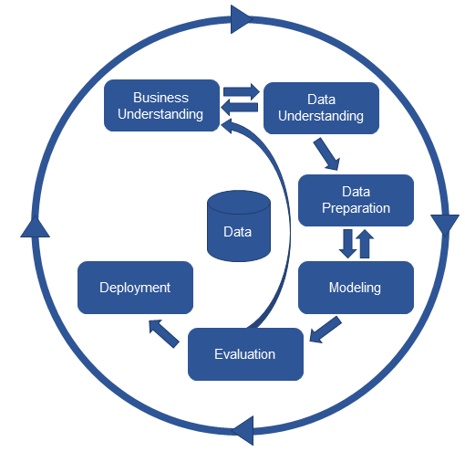

# Análise RFM, Clusterização e Análise dos Dados

# 1. CRISP-DM
Para este projeto irei utilizar a abordagem  CRISP-DM (Cross-Industry Standard Process for Data Mining).

O CRISP-DM é uma metodologia amplamente utilizada para guiar projetos de ciência de dados. Ele oferece uma estrutura organizada em seis fases principais que ajudam a conduzir o processo de análise de dados desde o planejamento até a implementação

## 1.1 Entendimento do Negócio
**Objetivo:** Analisar detalhadamente os dados de vendas para fornecer respostas a 5 perguntas chave de negócios, realizar uma análise RFM (Recência, Frequência e Valor Monetário) para segmentar os clientes de acordo com seus comportamentos de compra e aplicar técnicas de clusterização para identificar grupos distintos de clientes. Após essa segmentação, será implementada uma análise preditiva utilizando Random Forest para prever a probabilidade de um cliente pertencer a determinado cluster e entender quais fatores mais influenciam essa classificação. 

**Impacto esperado:** A análise permitirá uma segmentação mais eficaz dos clientes, revelando padrões de comportamento que podem ser utilizados para personalizar campanhas de marketing e estratégias de retenção. Além disso, a identificação das variáveis mais importantes no processo de decisão facilitará o desenvolvimento de ações direcionadas, melhorando a experiência do cliente e potencializando as vendas.

## 1.2 Entendimento dos Dados
**Dataset:** Online Retail II, disponível [aqui.](https://archive.ics.uci.edu/dataset/502/online+retail+ii) O conjunto de dados contém transações de uma loja de varejo online com sede no Reino Unido, abrangendo o período entre 2009 e 2011.

**Fonte:** Conjunto de dados de transações online de uma loja de varejo, incluindo informações como ID do cliente, produtos comprados, quantidade, data e preço.

**Estrutura de dados:** Contém tanto variáveis numéricas (como quantidade e preço) quanto variáveis categóricas (descrição do produto, país). Essas variáveis serão analisadas e manipuladas conforme necessário para atender aos objetivos do projeto, como a clusterização e a análise preditiva.

## 1.3 Preparação dos Dados
**Armazenamento:** Inserção dos dados em um banco de dados MySQL para facilitar a manipulação e execução de consultas. O acesso será feito através da integração com SQLAlchemy no Python, permitindo consultas eficientes e a realização de operações sobre os dados.

**Consultas e extrações:** Utilização de queries SQL para responder a 5 perguntas estratégicas de negócios, explorando o comportamento dos clientes e identificando tendências de vendas e padrões de compra.

**Análise RFM:** Aplicação de SQL para calcular Recência, Frequência e Valor Monetário (RFM) dos clientes. Essa análise permitirá a segmentação dos clientes com base em sua relevância para o negócio, fornecendo uma visão clara de quais clientes têm maior valor.

**Preparação para Clusterização:** Normalização dos dados e remoção de variáveis irrelevantes para garantir que a clusterização seja feita de maneira eficiente e com dados otimizados. O processo de preparação inclui a transformação das variáveis para que o algoritmo de clusterização KMeans funcione adequadamente.

**Árvore de Decisão (Random Forest):** Após a segmentação dos clientes por meio do KMeans, uma árvore de decisão, utilizando o modelo Random Forest, será aplicada para prever a probabilidade de um cliente pertencer a determinado cluster. Essa etapa é essencial, pois a árvore de decisão não apenas gera previsões, mas também nos mostra as variáveis que mais impactaram a segmentação. Com isso, será possível identificar quais fatores são determinantes na classificação dos clientes, permitindo uma melhor compreensão do comportamento deles e auxiliando na criação de estratégias de marketing mais eficazes.

## 1.4 Modelagem
**Clusterização:** Aplicação do KMeans para segmentação de clientes. Uso dos métodos do cotovelo e da silhueta para determinar o número ideal de clusters.

**Classificação:** Inclusão dos rótulos de cluster no dataset e aplicação de Random Forest para prever a probabilidade de um cliente pertencer a um determinado cluster.

**Interpretação:** Análise das features mais importantes no modelo Random Forest para entender os fatores-chave na classificação dos clientes.

## 1.5 Avaliação

**Métricas de Clusterização:** A qualidade dos clusters será avaliada utilizando duas abordagens principais:  
- Método do Cotovelo: Avalia a inércia (soma das distâncias quadradas dentro dos clusters) para determinar o número ideal de clusters. A escolha do ponto de inflexão no gráfico de inércia indicará o número adequado de clusters.
- Coeficiente de Silhueta: Medirá a coesão e a separação dos clusters. Um valor de silhueta próximo de 1 indica que os clientes estão bem segmentados em seus respectivos grupos, enquanto valores próximos de 0 indicam que eles estão mal segmentados ou nas fronteiras dos clusters.

**Métricas de Classificação:** A classificação será feita utilizando Random Forest, e a principal métrica de avaliação será o **Log Loss (Perda Logarítmica)**, que é a métrica mais adequada quando o objetivo é otimizar a probabilidade de um cliente pertencer a determinado cluster. O Log Loss penaliza previsões de probabilidade incorretas de forma mais sensível, garantindo que o modelo não apenas acerte a classe, mas também faça previsões de probabilidade robustas e confiáveis.

## 1.6 Implementação

**Entrega dos resultados:**  Além da documentação e apresentação dos resultados, incluindo as respostas detalhadas às cinco perguntas de negócios propostas, será disponibilizada uma tabela detalhada contendo a formação dos clusters e a probabilidade de cada cliente pertencer a cada um deles. Essa tabela poderá ser utilizada como uma base para alimentar diversos processos de negócios, como a personalização de campanhas de marketing, a otimização de estratégias de retenção e o desenvolvimento de ofertas personalizadas para cada segmento de clientes.

# 2. Projeto
## 2.1 Ferramentas e Tecnologias Utilizadas:
- Linguagens: 
    - Python 3.11.4
    - SQL
- Banco de Dados: MySQL.
- Bibliotecas e suas versões:  [`requirements.txt`](./requirements.txt).
- Versionamento: Git.
- Análise de Cluster: KMeans, métodos do cotovelo e silhueta.
- Análise preditiva: Random Forest.

## 2.2 Perguntas de negócios
- 1: Quais produtos são os mais vendidos?
Como podemos identificar os itens mais populares entre os clientes para garantir que o estoque desses produtos esteja sempre disponível?
- 2: Quais são as categorias de produtos mais compradas em diferentes períodos do ano? Como a sazonalidade afeta a demanda por determinados produtos e como podemos otimizar nosso inventário com base nessas informações?
- 3: Quais são os períodos de pico de vendas? Quais dias têm maior volume de vendas? Podemos ajustar nossa estratégia de marketing ou oferta de produtos durante esses períodos?
- 4: Quais clientes são responsáveis pelas maiores receitas? Quem são os clientes que mais gastam com base no valor total de suas compras?
- 5: Há algum produto com baixa rotação que deve ser descontinuado? Produtos com baixo volume de vendas podem ser reavaliados para manter a eficiência do inventário.

# 3 Resultados
## 3.1 Perguntas de negócios
**1 -  Quais produtos são os mais vendidos? Como podemos identificar os itens mais populares entre os clientes para garantir que o estoque desses produtos esteja sempre disponível?**
- Os produtos mais vendidos, conforme a análise de vendas, incluem itens como WORLD WAR 2 GLIDERS ASSTD DESIGNS, com 107.489 unidades vendidas, seguido pelo WHITE HANGING HEART T-LIGHT HOLDER com 90.008 unidades e o ASSORTED COLOUR BIRD ORNAMENT, com 79.434 unidades. Outros produtos populares incluem o JUMBO BAG RED RETROSPOT, BROCADE RING PURSE e diferentes variações de caixas de bolo, todos com volumes de vendas significativos que vão de 70.390 a 43.602 unidades. Para garantir que o estoque desses itens esteja sempre disponível e atender à demanda dos clientes, é fundamental identificar regularmente esses produtos mais vendidos. Ao fazer isso, a empresa pode evitar rupturas de estoque, melhorar a experiência do cliente, aumentar as vendas e minimizar os custos associados a excessos ou faltas de produtos em estoque. 

