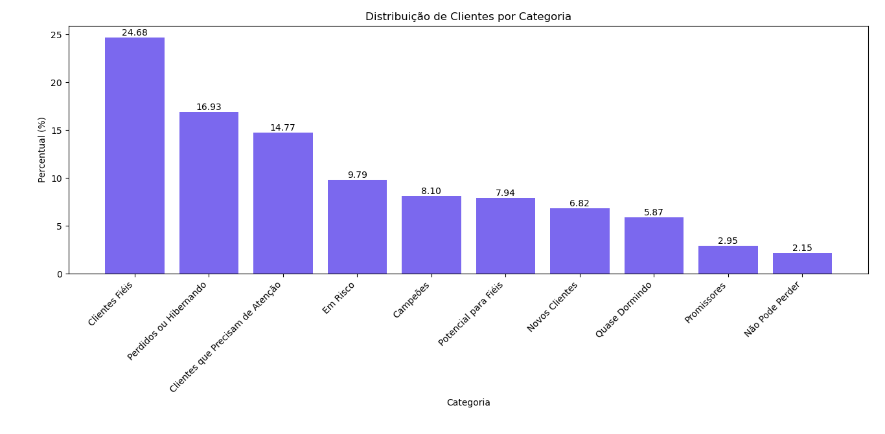
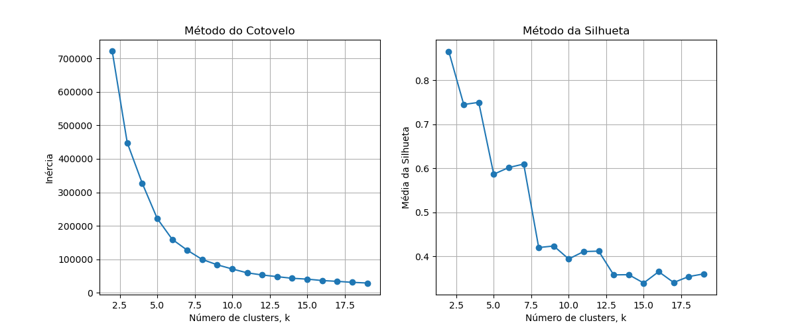
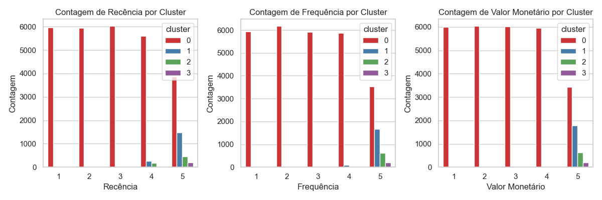
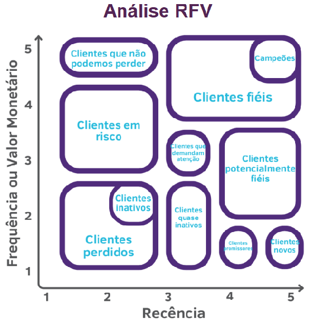

# Análise dos Dados, Análise RFV e Clusterização

# 1. CRISP-DM
Para este projeto irei utilizar a abordagem  CRISP-DM (Cross-Industry Standard Process for Data Mining).

O CRISP-DM é uma metodologia amplamente utilizada para guiar projetos de ciência de dados. Ele oferece uma estrutura organizada em seis fases principais que ajudam a conduzir o processo de análise de dados desde o planejamento até a implementação

## 1.1 Entendimento do Negócio
**Objetivo:** Analisar detalhadamente os dados de vendas para fornecer respostas a 5 perguntas chave de negócios, implementar uma análise RFM (Recência, Frequência e Valor Monetário) para segmentar os clientes de acordo com seus comportamentos de compra e aplicar técnicas de clusterização para identificar grupos distintos de clientes. 

**Impacto esperado e solução esperada:** A análise permitirá uma segmentação mais eficaz dos clientes, revelando padrões de comportamento que podem ser utilizados para personalizar campanhas de marketing e estratégias de retenção. Atualmente, sem uma segmentação clara, as campanhas de marketing e as iniciativas de retenção são menos direcionadas, o que pode resultar em baixo retorno sobre o investimento e perda de oportunidades de engajamento com diferentes grupos de clientes. 

**Requisitos:**  
- Dados: É fundamental ter um conjunto de dados histórico completo e bem organizado com campos essenciais, incluindo InvoiceNo, CustomerID, InvoiceDate, Quantity, UnitPrice, StockCode, Description e Country. Esses dados serão a base para calcular as métricas de Recência, Frequência e Valor Monetário e permitir uma análise RFM precisa. 

- Ferramentas: Para a manipulação e análise dos dados, foi usada uma combinação de SQL com o banco de dados MySQL, conectado ao Python para facilitar consultas e transformações eficientes nos dados. Python, juntamente com a biblioteca scikit-learn permitirá a implementação de algoritmos de clusterização. Essa integração entre MySQL e Python otimiza o fluxo de dados, facilitando a execução da análise RFM e a identificação de padrões de comportamento nos clientes.

## 1.2 Entendimento dos Dados
**Dataset:** Online Retail II, disponível [aqui.](https://archive.ics.uci.edu/dataset/502/online+retail+ii) O conjunto de dados contém transações de uma loja de varejo online com sede no Reino Unido, abrangendo o período entre 2009 e 2011.
- **Dicionário de Variáveis**
    - InvoiceNo: Número da Fatura. Nominal. Um número inteiro de 6 dígitos atribuído de forma única a cada transação. Se este código começar com a letra 'c', indica um cancelamento.
    - StockCode: Código do Produto. Nominal. Um número inteiro de 5 dígitos atribuído de forma única a cada produto distinto.
    - Description: Descrição do Produto. Nominal. Nome do produto (item).
    - Quantity: Quantidade. Numérico. Quantidade de cada produto por transação.
    - InvoiceDate: Data e Hora da Fatura. Numérico. O dia e a hora em que a transação foi gerada.
    - UnitPrice: Preço Unitário. Numérico. Preço do produto por unidade em libras esterlinas (£).
    - CustomerID: Número do Cliente. Nominal. Um número inteiro de 5 dígitos atribuído de forma única a cada cliente.
    - Country: País. Nominal. Nome do país onde o cliente reside.   
- **Identificamos nos dados algumas entradas de código de produto com as letras ('M', 'D', 'BANK CHARGES', etc.), que estão relacionadas a outros tipos de transações, como ajustes manuais, taxas e serviços adicionais. Esses códigos não são propriamente produtos físicos, mas serviços ou correções. Esses aspectos deverão ser levados em conta durante o projeto.**

**Fonte:** Conjunto de dados de transações online de uma loja de varejo, incluindo informações como ID do cliente, produtos comprados, quantidade, data e preço.

**Estrutura de dados:** Contém tanto variáveis numéricas (como quantidade e preço) quanto variáveis categóricas (descrição do produto, país). Essas variáveis serão analisadas e manipuladas conforme necessário para atender aos objetivos do projeto, como a clusterização e a análise preditiva.

## 1.3 Preparação dos Dados
**Armazenamento:** Inserção dos dados em um banco de dados MySQL para facilitar a manipulação e execução de consultas. O acesso será feito através da integração com SQLAlchemy no Python, permitindo consultas eficientes e a realização de operações sobre os dados.

**Análise de Dados:** Utilização de queries SQL para responder a 5 perguntas estratégicas de negócios, explorando o comportamento dos clientes e identificando tendências de vendas e padrões de compra.

**Análise RFV:** Aplicação de SQL para calcular Recência, Frequência e Valor Monetário (RFV) dos clientes. Essa análise permitirá a segmentação dos clientes com base em sua relevância para o negócio, fornecendo uma visão clara de quais clientes têm maior valor.

**Preparação para Clusterização:** Dimensionamento dos dados e remoção de variáveis irrelevantes para garantir que a clusterização seja feita de maneira eficiente e com dados otimizados. O processo de preparação inclui a transformação das variáveis para que o algoritmo de clusterização KMeans funcione adequadamente.

## 1.4 Modelagem
**Clusterização:** Clusterização: Implementação do algoritmo KMeans para segmentação de clientes com base nos dados RFM. Para definir o número ideal de clusters, serão aplicados os métodos do Cotovelo e da Silhueta, permitindo uma análise quantitativa da estrutura dos clusters e garantindo uma segmentação que maximize a homogeneidade dentro dos grupos e a distinção entre eles.

## 1.5 Avaliação

**Métricas de Clusterização:** A qualidade dos clusters será avaliada utilizando duas abordagens principais:  
- Método do Cotovelo: Avalia a inércia (soma das distâncias quadradas dentro dos clusters) para determinar o número ideal de clusters. A escolha do ponto de inflexão no gráfico de inércia indicará o número adequado de clusters.
- Coeficiente de Silhueta: Medirá a coesão e a separação dos clusters. Um valor de silhueta próximo de 1 indica que os clientes estão bem segmentados em seus respectivos grupos, enquanto valores próximos de 0 indicam que eles estão mal segmentados ou nas fronteiras dos clusters.

## 1.6 Entrega dos resultados:

Como entrega final, apresentaremos os resultados em um relatório que incluirá:

- Respostas detalhadas para cinco perguntas de negócios.
- Segmentação de Clientes: Um análise RFV com rótulos como “Campeões”, “Clientes Fiéis”, “Em Risco” e outros segmentos relevantes, acompanhado de gráficos que ilustram o comportamento de cada grupo.
- Gráfico de Clusters: Um gráfico detalhado que mostra a relação de cada cluster com as métricas de Recência, Frequência e Valor. A análise permite identificar padrões em cada cluster, facilitando a integração dessas informações para estratégias e decisões mais precisas.
- Documentação Técnica e Estratégica: O relatório também incluirá recomendações práticas para campanhas de marketing personalizadas e estratégias de retenção baseadas nos resultados obtidos.

# 2. Projeto
## 2.1 Ferramentas e Tecnologias Utilizadas:
- Linguagens: 
    - Python 3.11.4
    - SQL
- Banco de Dados: MySQL.
- Bibliotecas e suas versões:  [`requirements.txt`](./requirements.txt).
- Versionamento: Git.
- Análise de Cluster: KMeans, métodos do cotovelo e silhueta.

## 2.2 Perguntas de negócios
- 1: Quais produtos são os mais vendidos?
Como podemos identificar os itens mais populares entre os clientes para garantir que o estoque desses produtos esteja sempre disponível?
- 2: Quais os produtos mais compradas em diferentes períodos do ano? Como a sazonalidade afeta a demanda por determinados produtos e como podemos otimizar nosso inventário com base nessas informações?
- 3: Quais são os períodos de pico de vendas? Quais dias têm maior volume de vendas? Podemos ajustar nossa estratégia de marketing ou oferta de produtos durante esses períodos?
- 4: Quais clientes são responsáveis pelas maiores receitas? Quem são os clientes que mais gastam com base no valor total de suas compras?
- 5: Existem produtos com baixa rotatividade e valor unitário reduzido que deveriam ser descontinuados? Produtos com baixo volume de vendas e preço inferior podem comprometer a eficiência do inventário e, por isso, devem ser reavaliados. Para este cenário, consideraremos produtos que venderam menos de 30 unidades nos últimos dois anos e cujo valor unitário seja inferior a 1000 dólares.

# 3 Resultados
## 3.1 Perguntas de negócios
**1 -  Quais produtos são os mais vendidos? Como podemos identificar os itens mais populares entre os clientes para garantir que o estoque desses produtos esteja sempre disponível?**
- Os produtos mais vendidos, conforme a análise de vendas atualizada, incluem itens como WORLD WAR 2 GLIDERS ASSTD DESIGNS, com 109.169 unidades vendidas, seguido por WHITE HANGING HEART T-LIGHT HOLDER, com 93.640 unidades, e PAPER CRAFT, LITTLE BIRDIE, com 80.995 unidades. Outros produtos populares incluem ASSORTED COLOUR BIRD ORNAMENT e MEDIUM CERAMIC TOP STORAGE JAR, com 79.913 e 77.916 unidades vendidas, respectivamente. Além disso, há destaque para várias variações de caixas de bolo, como a PACK OF 60 PINK PAISLEY CAKE CASES (55.270 unidades), 60 TEATIME FAIRY CAKE CASES (53.495 unidades) e PACK OF 72 RETROSPOT CAKE CASES (46.107 unidades), além do JUMBO BAG RED RETROSPOT, que atingiu 75.759 unidades. Para garantir que o estoque desses itens esteja sempre disponível e atender à demanda dos clientes, é fundamental identificar regularmente esses produtos mais vendidos. Ao fazer isso, a empresa pode evitar rupturas de estoque, melhorar a experiência do cliente, aumentar as vendas e minimizar os custos associados a excessos ou faltas de produtos em estoque.

 **2 -  Quais os produtos mais compradas em diferentes períodos do ano? Como a sazonalidade afeta a demanda por determinados produtos e como podemos otimizar nosso inventário com base nessas informações?** 
 - A análise dos produtos mais vendidos ao longo dos meses revela padrões sazonais importantes. Em janeiro, o MEDIUM CERAMIC TOP STORAGE JAR foi o destaque com 74.215 unidades vendidas. Em fevereiro, o item de maior demanda foi o BLACK AND WHITE PAISLEY FLOWER MUG, com 19.248 unidades. Já em março, o SET/6 WOODLAND PAPER PLATES foi o mais vendido, com 13.099 unidades. O WORLD WAR 2 GLIDERS ASSTD DESIGNS apresentou bons números em abril, maio, junho e outubro, com vendas variando entre 13.790 e 13.968 unidades, demonstrando consistência. O ASSORTED COLOUR BIRD ORNAMENT também se destacou, especialmente em agosto e novembro, com 9.564 e 14.389 unidades vendidas, respectivamente. O BROCADE RING PURSE teve um bom desempenho em setembro, com 16.006 unidades vendidas. Por fim, em dezembro, o PAPER CRAFT, LITTLE BIRDIE liderou com 80.995 unidades vendidas, possivelmente refletindo a alta demanda sazonal. Com base nessas informações, é possível otimizar o inventário, ajustando os níveis de estoque de acordo com a sazonalidade. Produtos que apresentam picos em determinados meses devem ter um planejamento de estoque mais robusto nesses períodos, garantindo que a demanda seja atendida sem gerar falta de produtos ou excesso de estoque.

**3 - Quais são os períodos de pico de vendas? Quais dias têm maior volume de vendas? Podemos ajustar nossa estratégia de marketing ou oferta de produtos durante esses períodos?**

- A análise dos dias com maior volume de vendas revela que os picos ocorrem nos dias 9, 7, 15, e 18, com valores de vendas totais de 508.172, 453.529, 447.659, e 428.454, respectivamente. Esses dias apresentam uma demanda significativamente maior, sugerindo padrões consistentes de aumento de vendas. Outros dias com vendas expressivas incluem o dia 17, com 423.291 em vendas, e o dia 21, com 392.796. Esses padrões podem estar relacionados a influências sazonais ou eventos específicos que impulsionam a demanda em determinados momentos do mês. Para maximizar o potencial de vendas nesses dias de pico, seria interessante ajustar as estratégias de marketing e oferta de produtos. Isso pode incluir campanhas promocionais focadas nesses períodos, o aumento do inventário dos produtos mais vendidos e a intensificação de esforços de marketing, como campanhas publicitárias ou descontos especiais. Aproveitar esses picos de demanda garante que a empresa esteja preparada para atender ao aumento de vendas sem correr o risco de esgotar o estoque ou perder oportunidades de faturamento. Além disso, a antecipação e planejamento logístico adequados para esses dias mais movimentados pode evitar atrasos ou problemas operacionais, assegurando uma experiência positiva para os clientes e o aproveitamento máximo do potencial de vendas.

**4 - Quais clientes são responsáveis pelas maiores receitas? Quem são os clientes que mais gastam com base no valor total de suas compras?** 
- A análise dos clientes responsáveis pelas maiores receitas revela que o CustomerID 18102 é o cliente que mais gasta, seguido pelos CustomerID 14646, CustomerID 14156, CustomerID 14911, e CustomerID 17450. Esses clientes destacam-se como os principais responsáveis por uma grande parte da receita total.Esses clientes representam uma parcela significativa da receita da empresa, indicando que são clientes de alto valor. Eles podem ser considerados "clientes VIP", e a empresa pode adotar estratégias específicas para manter esses consumidores satisfeitos e incentivá-los a continuar comprando. Programas de fidelidade, descontos exclusivos e atendimento personalizado são algumas das táticas que podem ser implementadas para reforçar a relação com esses clientes de alto valor. Além disso, acompanhar de perto o comportamento de compra desses clientes pode ajudar a desenvolver ações de marketing mais eficazes e direcionadas, maximizando o retorno e garantindo que esses clientes continuem a gerar receitas significativas

**5 - Existem produtos com baixa rotatividade e valor unitário reduzido que deveriam ser descontinuados? Produtos com baixo volume de vendas e preço inferior podem comprometer a eficiência do inventário e, por isso, devem ser reavaliados. Para este cenário, consideraremos produtos que venderam menos de 30 unidades nos últimos dois anos e cujo valor unitário seja inferior a 1000 dólares.**
- A análise de produtos com baixa rotatividade e valor unitário reduzido revela que cerca de 3.000 produtos caem nessa categoria, tendo vendido menos de 30 unidades e com preço unitário inferior a 10 dólares. Exemplos desses produtos incluem o COPPER AND BRASS BAG CHARM, com apenas 1 unidade vendida a 9,96 dólares, o SET/10 PINK POLKADOT PARTY CANDLES, com 1 unidade vendida a 2,46 dólares, e o TUSCAN VILLA DOVECOTE BIRD FEEDER, que vendeu 29 unidades a 8,25 dólares.. Esses itens, com baixa rotatividade e baixo valor unitário, podem estar ocupando espaço desnecessário no estoque e comprometendo a eficiência da operação. Manter produtos com vendas tão reduzidas pode resultar em custos adicionais com armazenagem e gerenciamento de inventário. Portanto, é recomendável reavaliar esses itens para considerar sua descontinuação ou substituição por produtos com maior demanda e margem de lucro mais significativa. Ao descontinuar ou revisar esses produtos de baixo desempenho, a empresa pode otimizar seu inventário, liberando espaço e recursos para focar em itens de maior demanda e valor.

## 3.2 Análise RFV (Recência, Frequência e Valor Monetário)
- **Recência (R):** Refere-se ao tempo decorrido desde a última compra ou interação do cliente. Clientes que compraram recentemente têm maior probabilidade de fazer novas compras, enquanto aqueles que não compram há muito tempo tendem a ser menos engajados.
- **Frequência (F):** Mede a regularidade com que o cliente realiza compras ou interage com a empresa. Clientes mais frequentes geralmente têm maior valor para a empresa e podem ser priorizados em ações de fidelização.
- **Valor Monetário (V):** Representa o total gasto pelo cliente ao longo de suas interações com a empresa. Clientes de maior valor monetário são cruciais para o crescimento dos lucros.

### 3.2.1 Metodologia
- Para a análise, foi criada uma tabela chamada tabela_rfv, que consolida as informações de recência, frequência e valor monetário de cada cliente, com base nos dados de compras da tabela original online_retail_table disponível no MySQL. Esta tabela agregada foi gerada utilizando a querys SQL. 
- A tabela RFV foi gerada a partir de três métricas principais:
    - Recência: Calculada pela diferença em semanas entre a última compra de um cliente e a data mais recente registrada na base de dados.
    - Frequência: Medida pelo número total de compras realizadas pelo cliente no período analisado.
    - Valor Monetário: Somatório do valor total gasto por cada cliente em suas compras.

- Cada métrica foi dividida em cinco categorias (quintis), utilizando a função NTILE(5) para facilitar a segmentação. Os clientes com recência mais baixa, frequência mais alta e valor monetário mais alto foram classificados com as pontuações mais elevadas.

    - Recência: 
        - O 5º quintil terá os clientes que fizeram compras mais recentemente.
        - O 1º quintil terá os clientes que estão inativos há mais tempo.
    - Frequência:
        - O 5º quintil corresponde aos clientes que compraram com mais frequência, sendo os clientes mais ativos.
        -  1º quintil inclui os clientes que compraram menos vezes.
    - Valor Monetário:
         - O 5º quintil representa os clientes que gastaram mais dinheiro (clientes de maior valor).
         - O 1º quintil agrupa aqueles que gastaram menos.

- A query foi executada diretamente no banco de dados MySQL utilizando o SQLAlchemy.
- Após a geração da tabela RFV, será conduzida uma análise de clusterização utilizando algoritmos como K-means para agrupar os clientes em diferentes perfis.

### 3.2.2 Categorias de Clientes:

- **Campeões:** Clientes que possuem as maiores pontuações de Recência, Frequência e Valor Monetário (todas iguais a 5). Estes são os clientes mais valiosos e leais, comprando frequentemente, recentemente, e com um valor monetário elevado. São os melhores clientes da empresa e merecem atenção especial para mantê-los engajados e satisfeitos.  
    - Recência = 5, Frequência = 5, Valor Monetário = 5
- **Clientes Fiéis:** São clientes que compram com alta frequência e possuem uma recência e valor monetário moderado a alto. Eles estão entre os principais clientes da empresa, apesar de não serem os campeões. A lealdade deles é um indicativo de que merecem atenção contínua para manter seu nível de engajamento. 
    - Recência >= 3, Frequência >= 4, Valor Monetário >= 3
- **Potencial para Fiéis:**  Esses clientes estão próximos de se tornarem leais. Eles têm uma boa recência, mas frequência moderada, o que indica que estão em um estágio de desenvolvimento. Com as estratégias certas, eles podem ser convertidos em clientes fiéis.
    - Recência >= 3, Frequência = 3, Valor Monetário >= 3
- **Novos Clientes:** Clientes que fizeram sua primeira compra muito recentemente, mas ainda não demonstraram um comportamento de compra frequente. Eles são novos para o negócio e têm potencial para se tornar clientes fiéis com o tempo. O foco deve estar em aumentar o engajamento e criar um relacionamento de longo prazo.
    - Recência >= 4, Frequência <= 2
- **Promissores:** Estes são clientes que fizeram uma compra recente, mas têm baixo valor monetário. Eles mostram promessa de crescimento se forem engajados adequadamente. Com a estratégia certa, esses clientes podem evoluir para categorias mais valiosas, como "Clientes Fiéis".
    - Recência >= 4, Frequência > 2, Valor Monetário IN (1, 2)
- **Clientes que Precisam de Atenção:** Estes são clientes que a empresa deve focar, pois têm recência e frequência moderadas, mas seu valor monetário é significativo o suficiente para justificar atenção extra. O risco de perder esses clientes está presente, mas com um pequeno esforço eles podem se tornar mais ativos e lucrativos.
    - Recência entre 1 e 3, Frequência entre 1 e 5, Valor Monetário IN (3, 4)
- **Não Pode Perder:** Estes são clientes valiosos que não fizeram compras recentemente. Eles estão em alto risco de se tornarem inativos, mas seu valor passado indica que vale a pena tentar retê-los. Incentivos especiais ou campanhas de retenção podem ser eficazes para evitar a perda desses clientes, dada sua alta contribuição financeira anterior.
    - Recência entre 1 e 3, Frequência entre 1 e 5, Valor Monetário = 5
- **Quase Dormindo:** Estes clientes têm recência e frequência moderadas, mas seu valor monetário é baixo. Eles estão em risco de se tornarem inativos. Um esforço para reativá-los através de ofertas, campanhas de marketing ou atendimento personalizado pode aumentar a frequência de compras e movê-los para categorias mais lucrativas.
    - Recência entre 1 e 3, Frequência IN (3, 4), Valor Monetário IN (1, 2)
- **Em Risco:** Estes clientes estão em perigo de abandono. Eles têm uma recência e frequência baixas, e seu valor monetário também é baixo. Eles estão à beira de se tornarem clientes inativos ou perdidos, e uma ação imediata é necessária para tentar salvá-los.
    - Recência entre 1 e 3, Frequência IN (1, 2), Valor Monetário = 2
- **Perdidos ou Hibernando:** Clientes que se tornaram inativos e têm um valor monetário muito baixo. Esses clientes já não estão engajados e podem ser difíceis de reativar. O foco aqui pode ser limitado, mas ofertas especiais ou reengajamento podem ser tentados para trazê-los de volta, dependendo da estratégia de retenção da empresa.
    - Recência entre 1 e 3, Frequência IN (1, 2), Valor Monetário = 1

## 3.3 Clusterização
- Na análise de segmentação de clientes utilizando KMeans, aplicamos os métodos do Cotovelo e da Silhueta para determinar o número ideal de clusters. O método do Cotovelo avalia a inércia (a soma das distâncias quadradas dos pontos ao centro do cluster), enquanto o método da Silhueta mede a qualidade da separação entre os clusters.
- Observamos que, ao aumentar o número de clusters, a inércia diminui significativamente até o ponto onde as reduções se tornam menos acentuadas, sugerindo 4 clusters como a escolha ideal. O gráfico da média da silhueta também indica que a qualidade dos clusters é melhor para valores mais baixos de k, com um pico em k = 4, sugerindo que a separação entre os clusters é mais clara para esse valor.
- Ambos os métodos sugerem que k = 4 é o número de clusters mais adequado. O método da silhueta mostra que k = 4 oferece a melhor separação, e o cotovelo também aponta esse valor como uma escolha balanceada entre a separação e a redução da inércia.
- Com base nessas avaliações, decidimos seguir com 4 clusters, visando otimizar a segmentação dos clientes e melhorar a interpretação dos grupos.

- Score de Silhueta para KMeans: 0.7496

##  3.3.1 Análise por Cluster

- **Cluster 0:** A maioria dos clientes neste cluster apresenta baixa frequência de compra, baixa recência e menor valor monetário. Esses clientes podem ser divididos em diferentes subgrupos com características distintas. Aqueles com baixa recência, frequência e valor são potenciais candidatos ao churn, representando um risco elevado de abandonar a marca. Já os clientes com alta recência, apesar de terem baixa frequência e valor monetário, podem ser novos consumidores que ainda estão no início de seu relacionamento com a marca, oferecendo uma oportunidade de engajamento futuro. Além disso, há um grupo de clientes que já demonstra um maior valor monetário e frequência de compras, sugerindo um engajamento crescente e potencial para se tornarem clientes mais fiéis e valiosos.

- **Cluster 1, 2 e 3**  Esses clusters compartilham características semelhantes. A maioria dos clientes realiza compras de forma regular, estando majoritariamente classificados nas faixas de frequência 4 e 5, o que indica um alto nível de lealdade e engajamento. Além disso, esses clientes também estão concentrados na faixa de valor monetário 5, sugerindo que não apenas compram com frequência, mas também fazem compras significativas, tanto em volume quanto em valor, tornando-os clientes valiosos para a marca.

# 4 Sugestões de ação:

- Os **Campeões** são os clientes mais valiosos para o negócio, devemos identificar esses consumidores e recompensá-los com benefícios, como acesso antecipado a lançamentos e ofertas especiais. Esses clientes também tendem a ser grandes promotores da marca, podemos também incentivá-los a compartilhar suas experiências. Podemos pedir feedback para fortalecer o relacionamento com eles e aproveitar esses depoimentos em campanhas de marketing. Além disso, podemos desenvolver estratégias personalizadas para atrair novos clientes com características semelhantes. Essas ações ajudam a manter a lealdade dos Campeões e expandem a base de clientes.
- Os **Clientes Fiéis**  Para esses clientes, é importante oferecer recompensas, como descontos exclusivos ou programas de fidelidade, que valorizem essa relação. Outra estratégia eficaz é proporcionar acesso antecipado a novos produtos, o que incentiva o senso de exclusividade. Além disso, como já confiam na marca, esses clientes são ótimos para fornecer depoimentos e fazer indicações, ajudando a atrair novos consumidores. Personalizar campanhas com sugestões de produtos relacionados ao histórico de compras pode reforçar o engajamento. Essas ações são essenciais para manter a lealdade dos Clientes Fiéis e fortalecer ainda mais o relacionamento com a marca.
- Os **Clientes com Potencial para Fiéis** são consumidores demonstram um grande potencial para se tornarem leais à marca, e por isso é importante aproveitar esse momento para fortalecê-los. Oferecer programas de fidelidade pode ser uma excelente maneira de mantê-los engajados, além de criar uma sensação de exclusividade. Fazer com que se sintam especiais através de mensagens personalizadas pode reforçar essa conexão. Com essas ações, podemos aumentar a probabilidade de que esses clientes continuem comprando regularmente.
- Os **Novos Clientes** são aqueles que compraram recentemente, mas ainda com pouca frequência. Esse grupo está em um estágio inicial do relacionamento com a marca e, por isso, é crucial oferecer um bom processo de pós-venda, garantindo que eles tenham uma experiência positiva desde o início. Vale a pena também oferecer vale-descontos como forma de incentivo para futuras compras e criar um relacionamento personalizado, que ajude a construir uma conexão com esses consumidores. Essas ações podem transformar novos clientes em compradores recorrentes e aumentar sua lealdade à marca.
- Os **Promissores** são clientes que realizaram compras recentemente, mas ainda não gastaram muito. Este grupo tem grande potencial para aumentar seu envolvimento com a marca, desde que seja bem trabalhado. Uma boa estratégia é oferecer produtos em formato de teste (trial) para incentivá-los a explorar mais a oferta de produtos ou serviços. Além disso, é importante aprender mais sobre suas preferências e comportamentos para personalizar o atendimento e criar um relacionamento mais próximo e relevante. Essas ações podem despertar maior interesse nos Promissores e incentivá-los a se tornarem clientes mais frequentes e valiosos.
- Os **Clientes que Precisam de Atenção** são aqueles que fizeram comprascom frequência moderada e um valor acima da média, mas que podem não ter comprado recentemente. Para esses clientes, é essencial estar sempre disponível para tirar dúvidas e oferecer suporte rápido e eficiente, além de apresentá-los a novos lançamentos ou promoções. Essas ações são importantes para manter o interesse desses clientes, evitando que percam o engajamento e fortalecendo o relacionamento com a marca.
- Os **Clientes que Não Pode Perder** são aqueles que já compraram bastante, mas por algum motivo interromperam as compras. Há uma grande oportunidade aqui, e é crucial evitar que eles deixem de ser clientes de vez. Para isso, é essencial manter uma comunicação ativa, conversando diretamente com eles para entender suas necessidades e prevenir o churn. Oferecer promoções personalizadas e relevantes pode ser uma estratégia eficaz, já que esses clientes têm um bom histórico de compras e podem estar dispostos a pagar por ofertas de maior valor. Reativá-los é uma prioridade, pois representam uma parte significativa do faturamento.
- Os **Clientes Quase Dormindo** são aqueles que estão próximos de deixar de comprar. Eles representam um grupo de risco e podem ser perdidos se não forem reativados. Para trazê-los de volta, é essencial apresentar novos produtos e ofertas atrativas, além de compartilhar conteúdos que sejam realmente úteis para eles. Também é importante avaliar se vale a pena investir na reativação desses clientes, já que o volume de compras pode não ser tão expressivo. Uma comunicação cuidadosa e direcionada pode fazer a diferença para reengajá-los.
- Os **Clientes em Risco** são aqueles que já gastaram bastante ou compraram com frequência, mas há muito tempo não fazem novas compras. É fundamental agir rapidamente para evitar que eles deixem de ser clientes. Manter uma conversa direta com esses consumidores pode ajudar a entender o que os afastou e, assim, prevenir o churn. Além disso, oferecer melhorias nos produtos pode ser uma forma eficaz de estimular novas compras e reativar o interesse desses clientes. A ação rápida é essencial para trazer esse grupo de volta ao ciclo de compras.
- Os **Clientes Perdidos ou Hibernando** são aqueles que fizeram poucas compras ou adquiriram produtos de menor valor e nunca mais voltaram a comprar. Para esse grupo, é necessário avaliar se vale a pena tentar reativá-los. Se houver limitação de tempo ou recursos, esses clientes não devem ser priorizados. No entanto, pode ser útil solicitar feedback para entender o que levou à sua inatividade e se houve algum erro no processo. Essa análise pode oferecer insights valiosos para evitar que outros clientes sigam o mesmo caminho e melhorar a experiência geral dos consumidores

---
Autor:
Leticia da Luz
  

